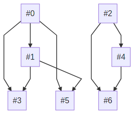

 
# CommandLine Dependency Builder
This tool allows you to statically analyze a list of Ethereum transactions and determine a safe order of concurrent execution.

The transaction list is specified in the JSON format (see `block.json` for an example); in particular the json file should contain a list of objects each one with at least the following fields:
1. `type`: either “constructor” or “method”; specifies whether this transaction is a contract creation or a method call.
2. `called_address`: a string containing either the address of the contract which method has been called, or the address in which the newly created contract will be deployed.
3. `data` : a string containing either the bytecode of the contract or the calldata of the method invocation.

The ouput is written to a file named “output.html”.

## Usage

~~~sh
./cldb <file.json>
~~~

## Command Output

The output of the tool is a diagram where each node is a transaction, the number on the nodes represents the index of the transaction in the provided list.

An arc between nodes **i** and **j** means that node **i** must be executed before node **j**.

JavaScript must be enabled to correctly display the graph.